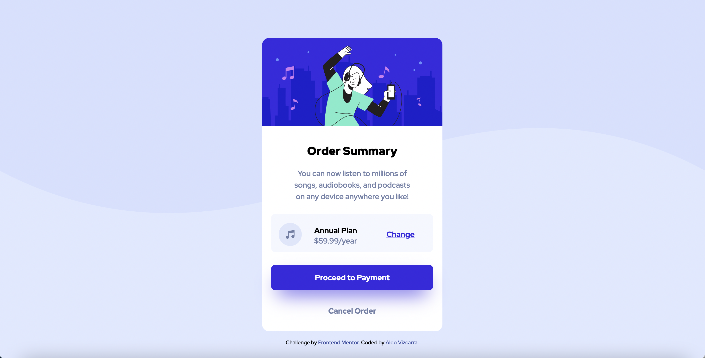

# order-summary-component

This is a solution to the [Order summary card challenge on Frontend Mentor](https://www.frontendmentor.io/challenges/order-summary-component-QlPmajDUj). Frontend Mentor challenges help you improve your coding skills by building realistic projects.

## Table of contents

- [Overview](#overview)
  - [The challenge](#the-challenge)
  - [Screenshot](#screenshot)
  - [Links](#links)
- [My process](#my-process)
  - [Built with](#built-with)
  - [What I learned](#what-i-learned)
  - [Continued development](#continued-development)
  - [Useful resources](#useful-resources)
- [Author](#author)
- [Acknowledgments](#acknowledgments)

## Overview

Order summary card solution

### The challenge

Users should be able to:

- See hover states for interactive elements

### Screenshot

### Links

- Solution URL: [Github](https://github.com/aldovizcarra/order-summary-component)
- Live Site URL: [Live Site](https://aldovizcarra.github.io/order-summary-component/)

## My process

First I created the html markup. Then I used css to make the mobile version first.

### Built with

- Semantic HTML5 markup
- CSS custom properties
- Flexbox
- Mobile-first workflow

### What I learned

During this project I learned how to make a mobile first workflow.

### Continued development

I want to continue learning css.

### Useful resources

- [Kevin Powell Discord](https://discord.gg/wqTAvQJE) - This discord gave me some tips and feedback.

## Author

- Website - [Aldo Vizcarra](https://github.com/aldovizcarra)
- Frontend Mentor - [@aldovizcarra](https://www.frontendmentor.io/profile/aldovizcarra)

## Acknowledgments

Thanks to the people on the Kevin Powell discord server.
